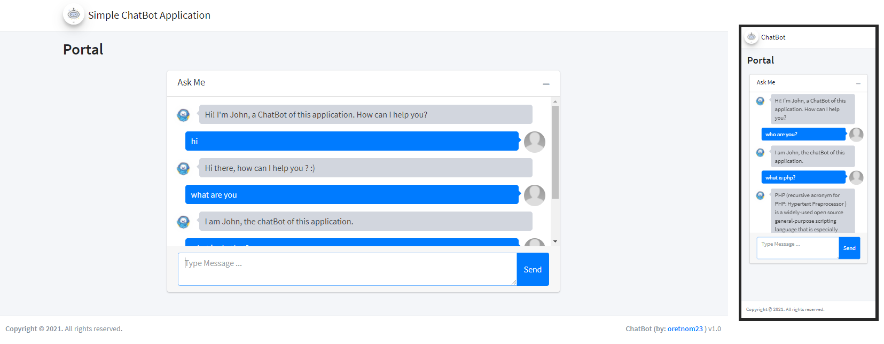

# Simple ChatBot Application using PHP

### Description

<i>This is a simple Web Application Project entitled Simple ChatBot Application. This project was develop using PHP Programming Language. This chatbot application can simulate conversations with the end-users. The end-user can ask/query anything with this application and the chatbot will automatically respond accordingly to the queries/questions.</i>

### Features

<strong>Public</strong>

<ul>
  <li><strong>Chatbot Convo</strong></li>
</ul>

<strong>Admin Panel</strong>

<ul>
  <li><strong>Home</strong></li>
  <li><strong>Manage System Settings</strong></li>
  <li><strong>Manage Responses</strong></li>
  <li><strong>Manage Unanswered Queries</strong></li>
</ul>

Visit the [sourcecodester.com](https://www.sourcecodester.com/php/14788/simple-chatbot-application-using-php-source-code.html) for more detailed information about this project.

| Title | Simple ChatBot Application using PHP with Source Code |
|:---|:---|
| Website | [www.sourcecodester.com](https://www.sourcecodester.com) |
| Link | https://www.sourcecodester.com/php/14788/simple-chatbot-application-using-php-source-code.html |
| Language | PHP |
| Developer/Uploader | [oretnom23](https://www.sourcecodester.com/users/tips23) |
